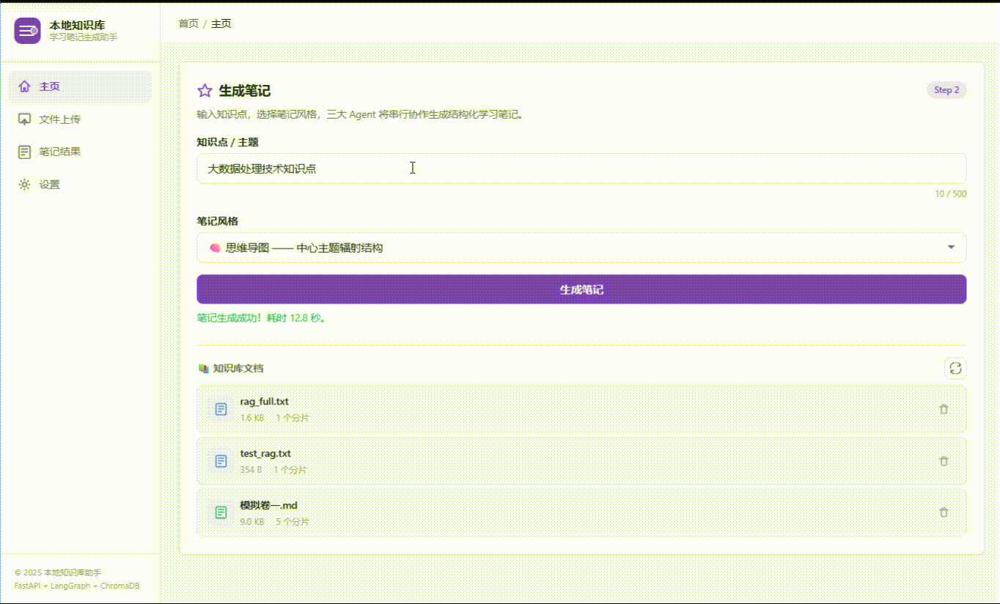

# 📚 本地知识库学习笔记生成助手

> 基于职能型多 Agent + LangGraph 编排的本地知识库学习笔记生成系统。
> 上传文档 → 向量检索 → 三 Agent 串行协作 → 结构化笔记 → 一键下载。

## ✨ 核心特性

- **🔍 私有知识库**：支持 TXT / MD / PDF 文档上传，自动解析、清洗、分片并向量化存入 ChromaDB，支持增量更新
- **🤖 三 Agent 协作**：检索 Agent → 理解 Agent → 生成 Agent，各自内置 Python 自检逻辑（LLM 仅作文本工具，不参与决策）
- **📝 三种笔记风格**：提纲（层级编号）、思维导图（Markdown 树形）、考点清单（Q&A + 考频）
- **📡 SSE 实时推送**：生成过程通过 Server-Sent Events 流式推送每个 Agent 的工作状态
- **📥 多格式下载**：提纲/考点清单 → `.docx` 排版输出；思维导图 → 前端渲染 SVG → `.pdf` 转换下载
- **📜 历史记录**：生成的笔记自动持久化，支持查询、回看、删除，最大保留 100 条
- **🎨 思维导图可视化**：纯 JS 实现的水平树状 SVG 渲染，支持缩放拖拽
- **🛡️ 防幻觉机制**：溯源校验（5 级匹配算法）+ 内容降噪 + 格式合规检查，LLM 输出必须源自素材

## 🎬 功能演示

| ✅ 正常功能演示 | ⚠️ 识别检测演示 |
|:---:|:---:|
|  |  |
| 上传文档 → 生成笔记 → 下载 | 输入校验 / 相关性检测 / 防幻觉拦截 |

## 📁 目录结构

```
pxiangmu-huizong/
├── frontend/                     # 前端（纯静态 HTML/CSS/JS）
│   ├── index.html                # 主页面（侧边栏导航 + 三区域布局）
│   ├── script.js                 # 核心逻辑（上传/生成/下载/思维导图渲染）
│   └── styles.css                # 样式系统（紫色主题，响应式布局）
├── backend/                      # 后端（Python FastAPI）
│   ├── requirements.txt          # Python 依赖
│   ├── .env.example              # 环境变量模板（不含密钥）
│   ├── app/
│   │   ├── __init__.py           # 包信息 + 版本号
│   │   ├── config.py             # 全局配置（路径/API/CORS/日志/向量库）
│   │   ├── main.py               # FastAPI 入口（路由/中间件/SSE/下载）
│   │   ├── schemas.py            # Pydantic 请求/响应模型
│   │   ├── agents.py             # 三 Agent 定义 + LangGraph 工作流
│   │   ├── vector_store.py       # ChromaDB 向量库管理（3 种 Embedding 后端）
│   │   ├── file_handler.py       # 文件校验/文本提取/清洗/分片
│   │   └── notes_store.py        # 笔记历史持久化（JSON，线程安全）
│   ├── knowledge/                # 上传文档存储目录
│   ├── chroma_db/                # ChromaDB 向量持久化目录
│   └── logs/                     # 应用日志目录
└── .gitignore
```

## 🚀 快速启动

### 环境要求

- **Python** ≥ 3.11
- **Windows** / macOS / Linux

### 1. 克隆项目

```bash
cd pxiangmu-huizong
```

### 2. 配置环境变量

```bash
cd backend
cp .env.example .env
# 编辑 .env，填入 DeepSeek API Key：
#   DEEPSEEK_API_KEY=sk-xxxxxxxxxxxxxxxx
```

### 3. 安装依赖

```bash
pip install -r requirements.txt
```

> 注意：`BAAI/bge-small-zh-v1.5` 本地 Embedding 模型首次运行会自动下载（约 100MB）。

### 4. 启动后端

```bash
uvicorn app.main:app --host 0.0.0.0 --port 8000 --reload
```

启动后访问：
- API 文档：http://localhost:8000/docs
- 健康检查：http://localhost:8000/api/health

### 5. 打开前端

直接用浏览器打开 `frontend/index.html`，或部署到任意静态服务器。

## 🔧 配置说明

所有配置项见 [backend/.env.example](backend/.env.example)：

| 配置项 | 说明 | 默认值 |
|--------|------|--------|
| `DEEPSEEK_API_KEY` | DeepSeek API 密钥（**必填**） | — |
| `DEEPSEEK_API_BASE` | API 端点 | `https://api.deepseek.com/v1` |
| `DEEPSEEK_CHAT_MODEL` | 对话模型 | `deepseek-chat` |
| `DEEPSEEK_EMBED_MODEL` | Embedding 模型 | `deepseek-embed` |
| `LLM_TEMPERATURE` | 生成温度 | `0.7` |
| `LLM_MAX_TOKENS` | 最大输出 token | `8192` |
| `SERVER_PORT` | 服务端口 | `8000` |
| `DEBUG_MODE` | 调试模式（开启 Swagger） | `false` |
| `CORS_ALLOW_ORIGINS` | 跨域白名单 | `localhost:3000,127.0.0.1:3000` |
| `VECTOR_SEARCH_TOP_K` | 检索返回条数 | `5` |

## 📡 API 接口

| 方法 | 路径 | 说明 |
|------|------|------|
| `GET` | `/api/health` | 健康检查 |
| `POST` | `/api/upload_file` | 上传文档到知识库 |
| `POST` | `/api/generate_note` | 生成笔记（SSE 流式） |
| `POST` | `/api/download_note` | 下载笔记文件（.docx / .pdf） |
| `GET` | `/api/files` | 知识库文件列表 |
| `DELETE` | `/api/files/{filename}` | 删除指定文件 |
| `DELETE` | `/api/files` | 清空知识库 |
| `GET` | `/api/notes` | 笔记历史列表（支持分页+风格筛选） |
| `GET` | `/api/notes/{id}` | 笔记详情 |
| `DELETE` | `/api/notes/{id}` | 删除指定笔记 |

## 🧠 工作流程

```
用户上传文档 → 文本提取 → 清洗 → 分片 → 向量入库
                                              ↓
用户输入查询 → RetrievalAgent（检索+相关性自检+摘要）
                    ↓
              UnderstandingAgent（构建知识框架+溯源校验）
                    ↓
              NoteGenerateAgent（套用模板+生成笔记+格式/内容自检）
                    ↓
              SSE 流式推送 → 前端渲染 → 下载 .docx / .pdf
```

### 三 Agent 设计哲学

```
Agent = Python 决策者（校验/自检/重试/路由）
LLM   = 纯文本工具（仅生成文本，不参与决策）
```

- **RetrievalAgent**：Python 做输入校验 → 向量检索 → 距离阈值过滤（≤0.8）→ bigram 关键词重合度检查（≥30%）→ 不通过则二次放宽检索 → LLM 摘要
- **UnderstandingAgent**：Python 做空素材拦截 → LLM 构建框架 → Python 溯源校验（5 级匹配算法：精确→子串→关键词→字符重叠→正则放宽）→ 结构合规检查 → 失败重试
- **NoteGenerateAgent**：Python 做风格校验 → LLM 套用模板生成 → Python 格式正则校验 → 内容降噪（AI 自述标记/重复率检测）→ 失败重试（最多 2 次）→ 降级兜底

## 🛠️ 技术栈

| 层级 | 技术 | 用途 |
|------|------|------|
| 前端 | HTML5 / CSS3 / Vanilla JS | 静态页面、文件上传、思维导图渲染 |
| 后端 | Python + FastAPI | API 服务、SSE 流式响应 |
| Agent 编排 | LangGraph StateGraph | 三 Agent 串行工作流 |
| LLM | DeepSeek (OpenAI 兼容) | 文本摘要 / 框架构建 / 笔记生成 |
| 向量库 | ChromaDB + LangChain | 语义检索、向量持久化 |
| Embedding | BAAI/bge-small-zh-v1.5（本地）| 离线中文语义向量 |
| 文档处理 | PyPDF2 / markdown | PDF 提取 / MD 转纯文本 |
| 文件生成 | python-docx / svglib + reportlab | .docx / SVG→PDF |
| 校验 | Pydantic v2 | 请求/响应数据模型 |

## 🎯 使用示例

1. **上传知识文档**：拖拽 `.txt` / `.md` / `.pdf` 到上传区，点击"上传并入库"
2. **生成笔记**：输入知识点（如"什么是RAG？请解释其工作原理"），选择笔记风格，点击"生成笔记"
3. **查看结果**：在结果页切换标签页查看「原文素材」「知识框架」「最终笔记」
4. **思维导图**：选择思维导图风格，可在 SVG 画布上缩放和拖拽浏览
5. **下载笔记**：点击"下载笔记"按钮，提纲风格获得排版精美的 `.docx`，思维导图获得 `.pdf`

## 📄 许可

MIT License
